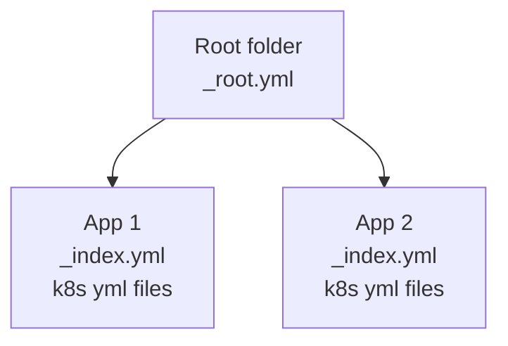

# Kubernetes / openshift templating and deployment engine

Simple python templating and deployment engine for openshift/k8 yml files. Detect changes made and only applies the
required objects.

## Use case

This tool was born in the need to a simple templating system which can track changes (similar to terraform) but
with k8s object awareness.

## Installation

- Python 3.8 or later
- `kubectl` or `oc` binary in path

```
pip install octoploy
```

## Usage



In octoploy you define apps, each app can contain multiple yml files. Additionally, there is a project configuration
which describes the k8 namespace.

All yml files will be pre-processed before they will be imported. This includes replacing any known `${KEY}` variables
with their associate values and merging referenced templates.

### Deploy / Plan

Deploys everything

```
octoploy deploy-all
```

Deploys all object of the app with the give name

```
octoploy deploy nginx
```

The same commands are available for `plan` - which will list changes to be applied.

```
octoploy plan / plan-all
```

This command executes the `on-config-change` trigger

```
octoploy reload prometheus
```

### Config structure

```
configs
|- _root.yml <- Root config
|- my-app <- App
    |- _index.yml <- App config
    |- dc.yml <- Openshift/K8 yml file(s)
    |- secrets.yml < Encrypted secrets file
```

### Root config

Here is a sample `_root.yml` file

```yml
# Name of the namespace / openshift project
namespace: 'my-oc-project'

# K8s context which should be used for deploying
context: 'my-k8s-cluster-config'

# OPTIONAL STUFF
# Global variables
vars:
  DOMAIN: "dev-core.org"
```

### App config

An app is represented by a folder containing an `_index.yml` file and any additional openshift yml files. The following
shows all available parameters. Only the first 3 are required.

```yml
# The type defines how the app will be used.
# Can be "app" (default) or "template"
type: 'app'

# Indicates if this app should be deployed or ignored
enabled: true

# Name of the deployment, available as variable, see below
name: 'my-app'

# Template which should be applied, none by default
applyTemplates: [ ]

# Templates which should be applied AFTER processing the other templates and base yml files
postApplyTemplates: [ ]

# Action which should be executed if a configmap has been changed
on-config-change:
  # Available options: 
  # deploy (re-deploys the deployment config - openshift specific)
  - deploy

  # exec (Executes a command inside the running container)
  - exec:
      command: /bin/sh
      args:
        - "-c"
        - "kill -HUP $(ps a | grep prometheus | grep -v grep | awk '{print $1}')"

# Additional variables which are used for replacements
vars:
  NSQ_NAME: 'nsq-core'

# Required parameters which must be passed to this app.
# This can be done via the CLI or if this app is a template the referring app can define it in "vars" 
params:
  - PASSWORD

# File based configmaps
configmaps:
  - name: nginx-config
    files:
      - file: "nginx.conf"
```

### Configmaps

In addition to the regular configmaps you can also define configmaps with a file source. This is done in
the `_index.yml` file:

```yml
configmaps:
  - name: nginx-config
    files:
      - file: "nginx.conf"
```

This will create a new configmap from the file `nginx.conf` with the name `nginx-config`. Any changes made to the file
will be automatically deployed.

### Variables

You can refer to variables in yml files by using `${VAR-NAME}`. Variables can also be loaded from files (see loaders
below).

```yml
# _index.yml
vars:
  # Regular key/value assignment
  key: value
```

It is also possible to decorate objects using variables and merge them into other objects:

```yml
# _index.yml
vars:
  someMerging:
    hello: world
    replicas: 2
```

```yml
# dc.yml
spec:
  replicas: 1
  _merge: ${someMerging}
```

Results in:

```yml
spec:
  replicas: 2
  hello: world
```

### Global variables

The following variables are available anywhere inside the yml files by default

| Key         | Value                                |
|-------------|--------------------------------------| 
| `APP_NAME`  | Name of the app in the `_index.yml`  |
| `NAMESPACE` | Name of the namespace in `_root.yml` |

### Value Loaders

You can load values from various sources using value loaders

```yml
vars:
  # This will load the public/private and intermediate certs
  # from a pem file and store it in *_KEY, *_PUBLIC, *_CACERT
  # where * is the key of the value.
  # In this example: CERT_KEY, CERT_PUBLIC, CERT_CACERT
  CERT:
    loader: pem
    file: my-cert.pem

  # Load the content of a file into "MY_FILE"
  MY_FILE:
    loader: file
    file: someFile.bin
    # Optional: Defines in which encoding the file content should be read
    # utf-8 by default, only applicable if "conversion" is not set.
    encoding: utf-8

    # Optional: Conversion can be used to convert a binary file 
    # into a string representation, in this base base64 
    conversion: base64

  # Load the content of environment variables into ENV_*
  ENV:
    loader: env
 ```

### Templates

You can use templates to reuse and generate yml files. This might be useful when you want
to attach sidecar containers to multiple apps. To do so you create a new app with the `type` field set
to `template`. Other apps can now refer to this template via the `applyTemplates` or `postApplyTemplates` field.
Templates can refer to other templates (recursively). Any vars defined are passed to the next template.


Example:

```
|- some-template
    |- _index.yml
    |- dc.yml

|- my-app
    |- _index.yml <-- Referes to "some-template"
    |- others.yml
```

Will result in

```
|- my-app
    |- _index.yml
    |- others.yml
    |- dc.yml
```

#### Object merging

The template engine support content aware object merging. This allows you to decorate existing templates or enhance apps
with features. A common example would be a template which adds a monitoring sidecar container. In the `examples` you can
find the `nsq-template` which defines a sidecar container.

Here is a minimal example:

```yml
# examples/nsq-template/dc.yml
kind: Deployment
apiVersion: apps/v1
spec:
  template:
    spec:
      containers:
        - name: "nsqd"
        image: "nsqio/nsq"
```

```yml
# examples/my-app/dc.yml
kind: Deployment
apiVersion: apps/v1
metadata:
  name: "${APP_NAME}"

spec:
  replicas: 1
  selector:
    name: "${APP_NAME}"
  strategy:
    type: RollingUpdate

  template:
    metadata:
      labels:
        name: "${APP_NAME}"

    spec:
      containers:
        - name: "${APP_NAME}"
          image: "docker-registry.default.svc:5000/oc-project/my-app:prod"
```

If we now apply the nsq-template to our app using `postApplyTemplates: [nsq-template]` the
`DeploymentConfig` object gets automatically merged:

```yml
# Merged result after applying template
kind: Deployment
apiVersion: apps/v1
metadata:
  name: "${APP_NAME}"

spec:
  replicas: 1
  selector:
    name: "${APP_NAME}"
  strategy:
    type: RollingUpdate

  template:
    metadata:
      labels:
        name: "${APP_NAME}"

    spec:
      containers:
        - name: "${APP_NAME}"
          image: "docker-registry.default.svc:5000/oc-project/my-app:prod"
        # This is the part of the template
        - name: "nsqd"
          image: "nsqio/nsq"
```

#### Loops

Loops allow you to apply the same template with different parameters. This is useful when deploying microservices which
all have the same openshift config.

```yml
# _index.yml
enabled: true
applyTemplates: [ api-template ]
forEach:
  # NAME is required for each instance that should be created
  - NAME: entity-compare-api
    # You can define other vars as well
    PORT: 8080

  - NAME: favorite-api
    PORT: 8081
```

#### Library

It's possible to define whole project as a `library`. This allows all apps and templates to be reused by another
project. An example would be the same setup for multiple systems which are separated by projects (e.g. `dev/test/prod`).

```yml
# testLib/_root.yml
type: library

# Required parameters
params:
  - domain
  - dockerDomain
  - imageStreamTag
```

```yml
# prod/_root.yml
namespace: 'prod-project'
inherit: testLib

# Required parameters
vars:
  domain: my-prod.dev-core.org
  dockerDomain: prod-docker.com
  imageStreamTag: prod
```

When you now deploy the `prod` project it will inherit all apps inside `testLib`.

## Secrets

You can encrypt your k8s secrets using

```bash
export OCTOPLOY_KEY="my password"
octoploy encrypt secrets.yml
```

The file will be updated in place.

For deploying encrypted secrets, you'll need to set the environment variable
`OCTOPLOY_KEY` with your key used to encrypt the data.

## State tracking

Octoploy currently uses a ConfigMap called `octoploy-state` to keep track of the object states.

The ConfigMap contains  all managed objects and their md5 sum. If this hash has changed the whole object will be
applied. If the object does already exist, but is not listed in the state it will simply be added to the state.

You can modify the name of the configmap by setting the `stateName` variable in the `_root.yml` file.

Currently, the actual fields of the yml files are not compared, however this is a planned feature.  

## Examples

All examples can be found in the `examples` folder.

## Contribute

The code should be mostly commented. If you found a bug or want to improve something feel free to open an issue and
discuss your ideas.